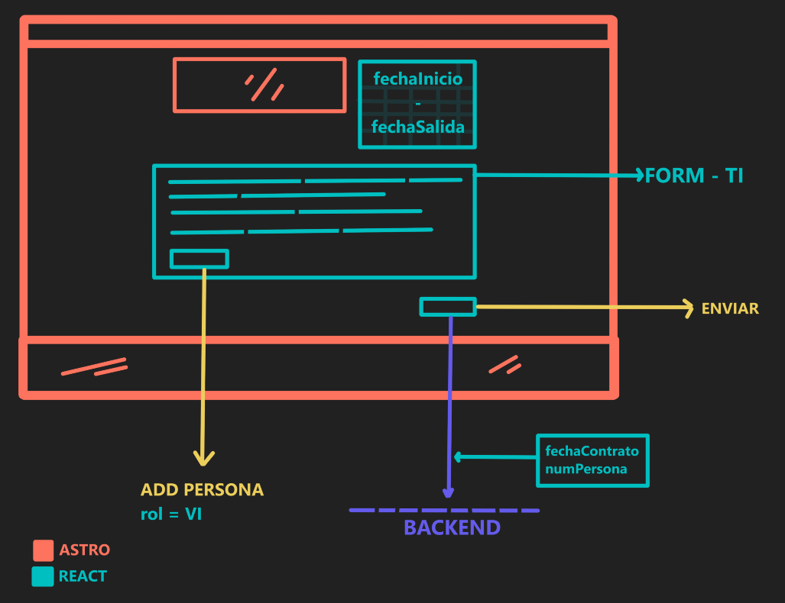
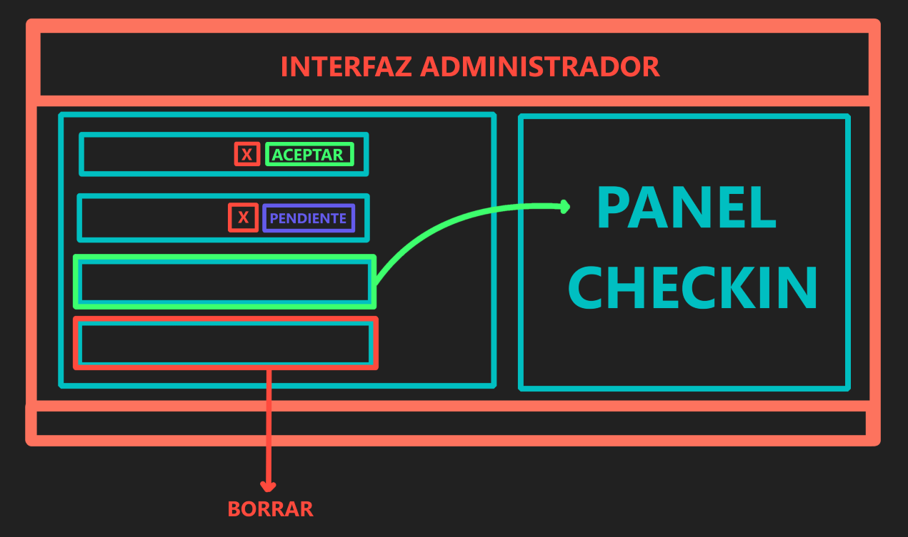

# FRONTEND

## VALIDACIÓN (SES)

### CABEZERA

- Codigo Arrendador: arrendador(String 10)
- Aplicación: aplicacion (String 50)
- Tipo Operación: tipoOperacion (String 1)
- Tipo Comunicación: tipoComunicacion (String 2)

### SOLICITUD/COMUNICACIÓN (A - RH)

#### ESTABLECIMIENTO (NO FORMULARIO)

- Codigo: codigo (String 10) **Solo importa este**
- Datos Establecimiento:
  - Tipo: tipo (String 10)
  - Nombre: nombre (String 10)
  - Dirección: direccion (Bloque)
    - direccion: direccion (String 100)
    - Código Postal: codigoPostal (String 20)
    - Pais: pais (String 3)

Nota: Los datos del establecimiento los vamos a omitir, porque solo es necesario si no tenemos código.

#### CONTRATO

- Referencia: referencia (String 50)
- Fecha Contrato: fechaContrato (Date AAAA-MM-DD) **INTERNO**
- Fecha Entrada: fechaEntrada (Date AAAA-MM-DDThh:mm:ss || AAAA-MM-DDT00:00:00) **FORM**
- Fecha Salida: fechaSalida (Date AAAA-MM-DDThh:mm:ss || AAAA-MM-DDT00:00:00) **FORM**
- Número de Personas: numPersonas (Number) **INTERNO**
- Pago: pago (Bloque)
  - Tipo de Pago: tipo (String 5)

#### PERSONA (1 - n)

##### PERSONA TITULAR (FORMULARIO)

- Rol: rol (String 2) **INTERNO**
- Nombre: nombre (String 50) **OBLIGATIORIO SES Y FORM**
- Apellido 1: apellido1 (String 50) **OBLIGATIORIO SES Y FORM**
- Apellido 2: apellido2 (String 50)
- Tipo Documento: tipoDocumento (String 5) **OBLIGATORIO FORM**
- Número Documento: numeroDocumento (String 15) **OBLIGATORIO FORM**
- Teléfono: telefono (String 20) **OBLIGATORIO FORM**
- Correo: correo (String 250) **OBLIGATORIO SES Y FORM**

NOTA: Hay que determinar que el número de documento corresponda con el tipo de docuemento,
es decir, que el formato sea válido en caso de NIF y NIE que tienen un formato es pecífico y
crear algoritmo que verifique es que es correcto.

##### PERSONA VIAJERO (FORMULARIO)

- Rol: rol (String 2) **NO SE PIDE**
- Nombre: nombre (String 50) **OBLIGATIORIO SES Y FORM**
- Apellido 1: apellido1 (String 50) **OBLIGATIORIO SES Y FORM**
- Apellido 2: apellido2 (String 50)
- Parentesco: parentesco (String 5) **MENOR 18 AÑO**
- Tipo Documento: tipoDocumento (String 5)
- Número Documento: numeroDocumento (String 15)
- Teléfono: telefono (String 20)
- Correo: correo (String 250)

NOTA: En caso del viajero tenemos que pedir que al menos rellene el campo teléfono o correo
ya que el SES pide al menos uno de esos campos, pero no requiere que rellene los 2, solo 1.
NOTA: Invesstigar valores de parentesco de TIPO_PARENTESCO.

## FORMULARIO CAMPOS

### CAMPOS INTERACTIVOS

**fechaEntrada y fechaSalida**: Panel interactivo para que el usuario elija el rango de fechas.
Es decir, el usuario no introduce datos, los elije de manera interactiva. (Aseguramos que siempre sea date)

**Campos persona**: Campos de tipo String, solo será necesario ajustar el máximo de letras según marca el SES.
En el apartado anterior se indica cuales son los campos y cuales son obligatorios.

### CAMPOS NO INTERACTIVOS

**Rol**: El campo Rol se asignará por defecto, es decir, el primer formulario rellendo, esta asignado por
defecto al que esta reservando por lo que el valor sera TI. El resto de formularios de registro tendrán el valor
de forma interna VI. (De forma interna gestionamos este campo, ajustandolo a String 2)

**numPersonas**: Este valor se rellena según la canidad de veces que se rellena el formulario de personas.

**fechaContrato**: Este valor se crea cuando se termina de rellenar el formulario y se envia finalmente al backend.

### CAMPOS SERVIDOR

**id_solicitud**: El ID que se crea al hacer una solicitud a la dueña, en fase de espera.
**id_reserva**: El ID que se crea al aprobar una solicitud.
**id_SES**: El ID SES es un ID creciente que se incrementa por cada reserva, es decir, el ID_SES
no es lo mismo que un ID_reserva. Ya que este es creciente y sigue una secuencia numérica ininturrumpida.

## DISEÑOS FINALES

### FORMULARIO

### INTERFAZ ADMINISTRADOR

